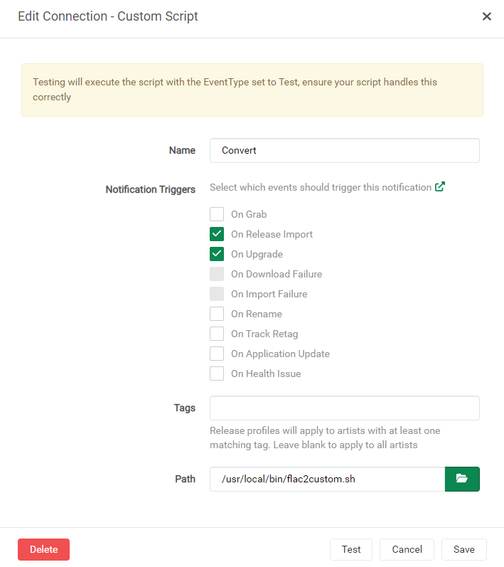

# [lidarr-on-steroids](https://github.com/youegraillot/lidarr-on-sterois/)

[](https://github.com/youegraillot/lidarr-on-steroids)
[](https://hub.docker.com/r/youegraillot/lidarr-on-steroids)
[](https://hub.docker.com/r/youegraillot/lidarr-on-steroids)

This repository bundles a modded version of Lidarr and Deemix into a docker image featuring :
  - Deemix with integration as an indexer and downloader for Lidarr
  - Automatic Lidarr and Deemix configuration
  - Automatic conversion from any format with ffmpeg
  - Podman compatibility with rootless mode

## Usage

### Parameters

| Parameter | Function |
| :----: | --- |
| `-p 8686` | Lidarr WebUI |
| `-p 6595` | Deemix WebUI |
| `-e PUID=1000` | for UserID |
| `-e PGID=1000` | for GroupID |
| `-e AUTOCONFIG=true` | Enable automatic configuration - see below for explanation |
| `-v /config` | Configuration files for Lidarr. |
| `-v /config_deemix` | Configuration files for Deemix. |
| `-v /downloads` | Path to your download folder for music. |
| `-v /music` | Music files. |

### Docker Run

```shell
docker run \
  --name lidarr \
  -p 8686:8686 \
  -p 6595:6595 \
  -v <path>:/config \
  -v <path>:/config_deemix \
  -v <path>:/downloads \
  -v <path>:/music \
  --restart unless-stopped \
 youegraillot/lidarr-on-steroids
```

### Docker Compose

```yml
version: "3"
services:
  lidarr:
    image: youegraillot/lidarr-on-sterois
    restart: unless-stopped
    ports:
      - "8686:8686" # Lidarr web UI
      - "6595:6595" # Deemix web UI
    volumes:
      - <path>:/config
      - <path>:/config_deemix
      - <path>:/downloads
      - <path>:/music
```

## Automatic configuration

Deemix comes with optimal settings allowing Lidarr integration, in particular regarding the folder structure ("createCDFolder" is required for this to work). `DEEMIX_SINGLE_USER` environment variable is also set to `true` to allow the `setup` script to read the corresponding ARL.

The `setup` service will install the Deemix plugin. This requires Lidarr to be restarted once.

The only manual manipulation you'll have to do is filling your Deezer credentials in Deemix web UI (port [6595](http://localhost:6595) by default). Once the `/config_deemix/login.json` is filled with the resulting ARL, the `setup` will be able to create the following :
  - /music root folder if no other root folder is configured
  - Delay profile allowing Deemix to be used by automatic search
  - Deemix as an indexer
  - Deemix as a download client

In case you don't want the automagical part (which is really the only value of this image), just set `AUTOCONFIG` environment variable to `false`.

## Audio files conversion

The image uses a modded version of [lidarr-flac2mp3](https://github.com/TheCaptain989/lidarr-flac2mp3) allowing conversion from any format.

To enable conversion on Lidarr import, create a new Connection to a Custom Script. You can also provide your own custom conversion script here, see [lidarr-flac2mp3](https://github.com/TheCaptain989/lidarr-flac2mp3) for mode information.



## Acknowlegment

This project is just a compilation of various tools made possible by those projects :

- [Lidarr](https://github.com/Lidarr/Lidarr) and especially [ta264](https://github.com/ta264) for the plugin integration
- [lidarr-flac2mp3](https://github.com/TheCaptain989/lidarr-flac2mp3) for the format conversion script
- [Deemix](https://deemix.app/) for the downloader backend
- [hotio](https://hotio.dev/) for the base docker image

Alternatively you could use [Deemixrr](https://github.com/TheUltimateC0der/deemixrr) which pretty much offers the same functionalities without the *starr of the various Sonarr forks.
